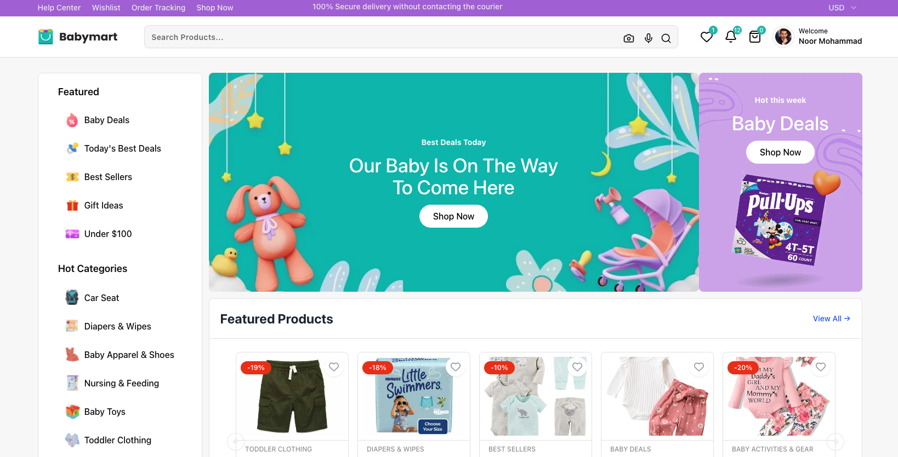

# Turbo BabyMart - The Ultimate E-commerce Monorepo



Welcome to **Turbo BabyMart**, a production-ready, full-stack e-commerce solution built with modern technologies. Whether you're a startup looking to launch quickly or a developer learning enterprise-grade architecture, this project has everything you need.

## 🚀 Key Features

### 🛍️ Web Storefront (Next.js)
- **High Performance**: Built with Next.js 15 (App Router) for blazing fast load times.
- **Beautiful UI**: Designed with Tailwind CSS & Shadcn UI for a premium feel.
- **SEO Optimized**: Meta tags, OpenGraph, Sitemap, and JSON-LD structured data included.
- **Responsive**: Perfectly optimized for Desktop, Tablet, and Mobile.

### 📱 Mobile App (React Native)
- **Cross-Platform**: iOS and Android apps from a single codebase.
- **Native Experience**: Smooth animations and native gestures.
- **Synchronized Data**: Real-time sync with the backend.

### ⚡ Power Admin Dashboard (Vite + React)
- **Product Management**: Create, edit, and manage inventory easily.
- **Order Processing**: Track status, print invoices, and manage shipments.
- **Analytics**: Visualization of sales, revenue, and user growth.

### 🔒 Secure Backend (Express & MongoDB)
- **Role-Based Auth**: Secure JWT authentication for Admins and Customers.
- **Scalable Database**: MongoDB architecture designed for e-commerce.
- **Payment Integration**: Stripe & SSLCommerz pre-integrated.

## 🛠️ Tech Stack

- **Monorepo**: Turborepo, pnpm
- **Frontend**: Next.js 15, React 19, Tailwind CSS, Shadcn UI
- **Admin**: Vite, React, Recharts
- **Mobile**: React Native, Expo compatible
- **Backend**: Node.js, Express, Mongoose
- **Database**: MongoDB (Atlas/Local)
- **Services**: Firebase Auth, Cloudinary/S3, Stripe, Gmail SMTP

## 📚 Getting Started

We have prepared detailed guides to get you up and running in minutes.

### 1. [Installation & Setup](docs/SETUP.md) 👈 START HERE
Follow our step-by-step guide to install dependencies, configure environment variables, and run the project locally.

### 2. [Basic Skills Required](docs/BASICS.md)
Check if you have the necessary skills to customize and maintain this project.

### 3. [Production Guide](docs/PRODUCTION_READY.md)
Ready to go live? Read our checklist for deploying to Vercel and other platforms.

### 4. [Database Setup & Data Import](docs/DATABASE_SETUP.md)
Import our demo data (products, categories, banners) into your MongoDB to get started instantly.

## 🧱 Project Structure

This project uses a Monorepo structure for efficient code sharing.

```
babyshop/
├── apps/
│   ├── web/          # Next.js Customer Storefront
│   ├── admin/        # React Admin Dashboard
│   ├── mobile/       # React Native App
│   └── api/          # Express Backend Server
├── packages/
│   ├── types/        # Shared TypeScript Interfaces
│   ├── ui/           # Shared Design System
│   └── config/       # Shared Constants
├── docs/             # Documentation & Guides
```

## 🔐 Environment Variables

We have included `.env.example` files in each application directory. Please refer to [SETUP.md](docs/SETUP.md) for a guide on where to get all the required API keys.

---

## 📞 Support & Customization

If you need help customizing this project or have any questions, please reach out!

**Created with ❤️ by ReactBD**
